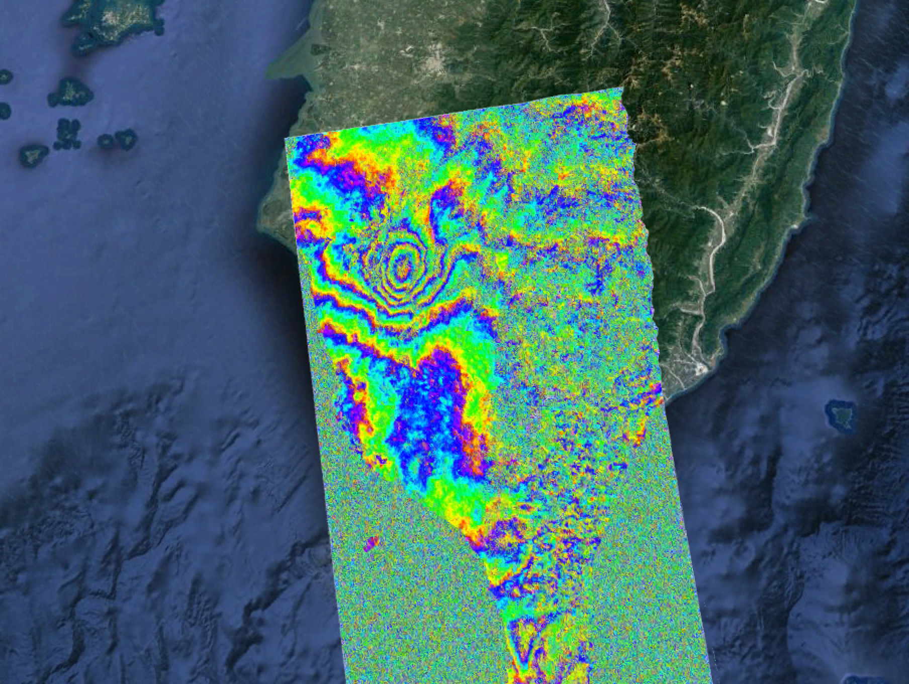
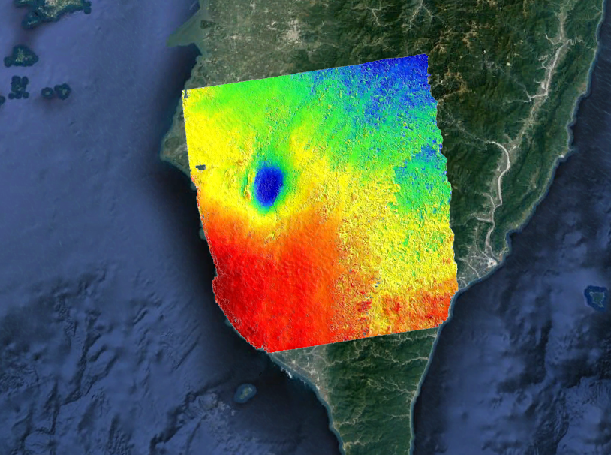

## Team: Awesome
## Member: Elena Osorio, Qingkai Kong  

---   

### Project 1: Sentinel-1A data processing
#### Event:
  

#### Results:

---

## **Acknowledgement**  
Thank:  
[UNAVCO](http://www.unavco.org/) for providing the financial support.  
[GMTSAR developer team](http://topex.ucsd.edu/gmtsar/) for the great workshop.  
[GMT team](https://www.soest.hawaii.edu/gmt/) for great support!  

